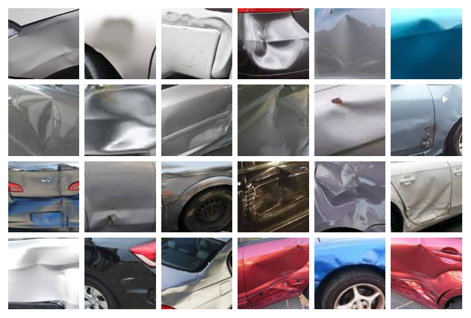
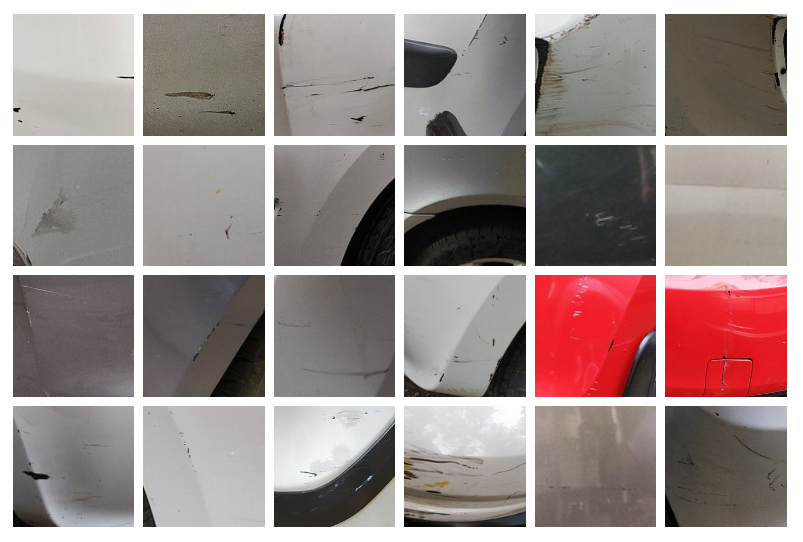

# Detection of Dents and Scratches on Car Body

## Steps of the project

- Perform a Scale Invariant Feature Tranform (SIFT) and Speeded Up Robust Features (SURF) feature extraction on a labeled training set of images and train a Gradient Boosting classifier.

## 1. Loading Images and Extracting feature using SIFT Feature Extractor
All the images of dents and scratches folder were loaded. It was resized into 280x430 and converted to grayscale.
The code for extracting the SIFT features is mentioned in the function def feature_SIFT. This function append two things (keypoints, descriptors) in csv file if is not corrupted.
```python
#read images from file names and resizes to 280x430 and converted to grayscale
def feature_SIFT(folder_name, csv_dest):
    i=0
    for filename in tqdm(os.listdir(folder_name)):
        #path
        path=os.path.join(folder_name,filename)
        a=cv2.imread(path)

        #resize image
        resize=(280,430)
        img=cv2.resize(a,resize)

        #gray image
        gray = cv2.cvtColor(img, cv2.COLOR_BGR2GRAY)
        
        #edge detection
        img_prewittx = cv2.filter2D(gray, -1, kernelx)#Horizontal 
        img_prewitty = cv2.filter2D(gray, -1, kernely)#Vertical
        img_prewitt = img_prewittx + img_prewitty

        #initialise sift descriptor
        sift = cv2.xfeatures2d.SIFT_create()
        keypoints, descriptors = sift.detectAndCompute(img_prewitt, None)

        #convert the descriptor array into a dataframe format
        out=pd.DataFrame(descriptors)
        print("descriptor shape ",i," : ", out.shape)
        i=i+1

        #drop first coloumn as it's the no of feature detected. Not required.
        #append to the csv file if image is not corrupted
        if int(out.shape[0]) != 0:
            csv_data=out.to_csv(csv_dest, mode='a', header=False,index=False)
```

## 2. Loading Images and Extracting feature using SURF Feature Extractor
All the images of dents and scratches folder were loaded. It was resized into 280x430 and converted to grayscale.
The code for extracting the SURF features is mentioned in the function def feature_SURF. This function append two things (keypoints, descriptors) in csv file if is not corrupted.
```python
#read images from file names and resizes to 280x430 and converted to grayscale
def feature_SURF(folder_name, csv_dest):
    i=0
    for filename in tqdm(os.listdir(folder_name)):
        #path
        path=os.path.join(folder_name,filename)
        a=cv2.imread(path)

        #resize image
        resize=(280,430)
        img=cv2.resize(a,resize)

        #gray image
        gray = cv2.cvtColor(img, cv2.COLOR_BGR2GRAY)
        
        #edge detection
        img_prewittx = cv2.filter2D(gray, -1, kernelx)#Horizontal 
        img_prewitty = cv2.filter2D(gray, -1, kernely)#Vertical
        img_prewitt = img_prewittx + img_prewitty
        
        #initialise surf descriptor
        surf = cv2.xfeatures2d.SURF_create()
        surf.setExtended(True)
        keypoints, descriptors = surf.detectAndCompute(img_prewitt, None)
        
        #convert the descriptor array into a dataframe format
        out=pd.DataFrame(descriptors)
        print("descriptor shape ",i," : ", out.shape)
        i=i+1

        #drop first coloumn as it's the no of feature detected. Not required.
        #append to the csv file if image is not corrupted
        if int(out.shape[0]) != 0:
            csv_data=out.to_csv(csv_dest, mode='a', header=False,index=False)
```
- **Example of Dents on Car images**
<p float="left">
  
</p>


- **Example of Scratches on Car images**
<p float="left">
  
</p>

- **Example of Car images**
<p float="left">
  
</p>


## 3. Elbow Method
- The value of K was selected based on elbow method. 
- The SIFT and SURF feature vector were divided independently into 18 clusters using k-means classifier. 
- The two K-means models’ output vector for each image were normalised and transformed into 18-bin histograms. 
- The histograms were concatenated to form a feature vector of size 1x36 for each image. 
- Feature vector of all images were appended to form a resultant vector of size 8000x36.

```python
#optimal K for SIFT
distortions = []
K = range(1,50, 4)
for k in tqdm(K, total=len(K)):
    kmeanModel = KMeans(n_clusters=k)
    kmeanModel.fit(datasift)
    distortions.append(kmeanModel.inertia_)
    print("For K =" + str(k) + " " + str(kmeanModel.inertia_))
```
- **Graph for K-Means of SIFT Feature Extractor**
<p float="left">
  
</p>

```python
#optimal K for SIFT
distortions = []
K = range(1,50, 4)
for k in tqdm(K, total=len(K)):
    kmeanModel = KMeans(n_clusters=k)
    kmeanModel.fit(datasurf)
    distortions.append(kmeanModel.inertia_)
```
- **Graph for K-Means of SURF Feature Extractor**
<p float="left">
  
</p>


## 4. Preparing Training Data
- After Extracting all the features from dents, scratch and negative images we created the final feature set by appending them together and then created the final labels by stacking ones equal to length of vehicle data and stacking zeros equal to length of non vehicle data

```python
#appending All classes into 1 csv file

A=dat1.append(dat2)
A=A.append(dat3)
csv_data=A.to_csv('D:\CV_project_data\Final_Features.csv', mode='a',header=False,index=False)
```
    Shape of features list is  (8056, 37)
       - 0 to 36 features and 37 columns label
    
- We reduced dimensions from 36 to 26 using PCA
```Python
from sklearn.preprocessing import StandardScaler
DhoniS = StandardScaler()
Dhoni = DhoniS.fit_transform(x)
from sklearn.decomposition import PCA
pca = PCA(n_components=None)
#pca.fit(Dhoni)
pca.fit(x)
Bhumi = pca.transform(x)
print(pca.explained_variance_ratio_)
l = pca.explained_variance_ratio_
l = l[:26]
l.sum()
pca = PCA(n_components=26)
pca.fit(x)
Bhumi = pca.transform(x)
B=pd.concat([Bhumi, pd.DataFrame(y)],axis=1)

- We then divided the featureList and labelList into train and test set

#assigning x the columns from 0 to 26 for training
x = data.iloc[:,0:26].values
print("X values")
print(x)

#assigning y with the column "Class" as target variable
y = data.iloc[:,26]
print("Y values")
print(y)
print(np.unique(y))

#Dataset split into train and test with 80% Training and 20% Testing
x_train, x_test, y_train, y_test = train_test_split(x, y, test_size=.20, random_state=0)
```

## 5. Training 5 classical Machine Learning Classifiers and select best one

The final step is to train the classifier. We used gradient boosting with random forest classifier as initial predication.
We were able to achieve a test accuracy of 84.8%.
```python
model2 = RandomForestClassifier()
model2.fit(x_train, y_train)
y_pred2 = model2.predict(x_test)
```

## 6. Method for detection
Further we can detect dents and scratch on car body in an images by giving input image.
The basic points to note here are-
- Input image is resize to 280x430, converted to grayscale and prewitt operator is used.
- SIFT and SURF feature extractiom is applied. 
- K-means and PCA is used for dimensionality reduction.
- Final obtained feature vector is given to the classifier for prediction.

```python
a=cv2.imread(path)
resize=(280,430)

#resize image
img=cv2.resize(a,resize)
gray = cv2.cvtColor(img, cv2.COLOR_BGR2GRAY)

img_prewittx = cv2.filter2D(gray, -1, kernelx)#Horizontal 
img_prewitty = cv2.filter2D(gray, -1, kernely)#Vertical
img_prewitt = img_prewittx + img_prewitty

sift = cv2.xfeatures2d.SIFT_create()    
keypoints_sift, descriptors_sift = sift.detectAndCompute(img_prewitt, None)

out_sift = pd.DataFrame(descriptors_sift)

#predict values of feature vector with pretrained kmeans

array_double = np.array(out_sift, dtype=np.double)

a1=pretrained_model_sift.predict(array_double)

hist=np.histogram(a1, bins=[0,1,2,3,4,5, 6, 7, 8, 9, 10, 11, 12, 13, 14, 15, 16, 17, 18])
hist_list = list(hist)
hist_list[0] = hist_list[0]/out_sift.shape[0]

surf = cv2.xfeatures2d.SURF_create()
surf.setExtended(True)
keypoints_surf, descriptors_surf = surf.detectAndCompute(img_prewitt, None)

out_surf = pd.DataFrame(descriptors_surf)
array_double2 = np.array(out_surf, dtype=np.double)
a2=pretrained_model_surf.predict(array_double2)

hist2=np.histogram(a2, bins=[0,1,2,3,4,5, 6, 7, 8, 9, 10, 11, 12, 13, 14, 15, 16, 17, 18])
hist_list2 = list(hist2)
hist_list2[0] = hist_list2[0]/out_surf.shape[0]

#append the dataframe into the array in append mode, the array will only have 36 values which will store the values in a row
hist_new = np.concatenate((hist_list[0],hist_list2[0]), axis = None)
data1.append(hist_new)

Output = pd.DataFrame(data1)

pca = pickle.load(open('PCA_Model_26.sav', 'rb'))
MB = pca.transform(Output)
y_pred4 = model4.predict(MB)
```


# References
- [https://scikit-image.org/docs/stable/auto_examples/features_detection/plot_sift.html)
- [https://docs.opencv.org/3.4/df/dd2/tutorial_py_surf_intro.html)
- [https://scikit-learn.org/stable/modules/generated/sklearn.ensemble.RandomForestClassifier.html)


